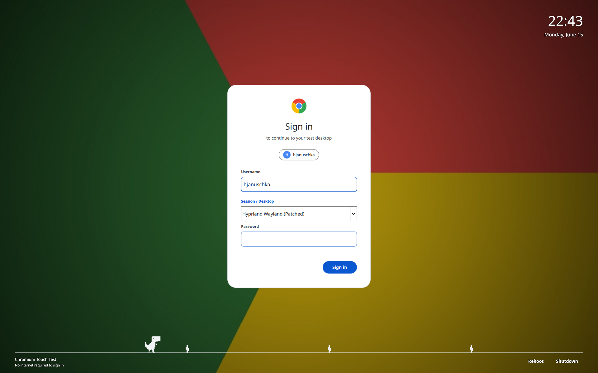

# chromium-sddm

A Chrome/Google-style SDDM greeter theme. A clean white "Sign in" card
(Chrome logo, account chip, username/session/password fields) floats over
the full desktop wallpaper -- no grey overlay, so the background shows at
full brightness.



## Demo

Full dino run (runs the whole width and hops the cacti):

https://github.com/hjanuschka/chromium-sddm/raw/master/dino_run.mp4

<video src="https://github.com/hjanuschka/chromium-sddm/raw/master/dino_run.mp4" controls width="100%"></video>

## Features

- Google "Sign in" card layout with rounded corners and entrance animation
- Chrome-logo canvas drawing and a pixel-art dino in the footer
- Prominent **Session / Desktop** selector below the username
- Live clock (top right), Caps Lock warning, shake-on-failure animation
- Reboot / Shutdown actions
- Full wallpaper visible (no semi-transparent wash over the background)

## Install

```bash
sudo cp -r theme /usr/share/sddm/themes/chromium-test
```

Then point SDDM at it, e.g. `/etc/sddm.conf.d/10-chromium-test.conf`:

```ini
[Theme]
Current=chromium-test
Background=/path/to/your/wallpaper.jpg
```

Set your wallpaper in `theme/theme.conf` (the `background=` key) or via the
`Background=` key above, and restart SDDM:

```bash
sudo systemctl restart sddm
```

## Requirements

- SDDM with Qt 6 (`sddm-greeter-qt6`)
- `QtQuick 2.15` and `SddmComponents 2.0`

## License

GPL (matches the upstream SDDM example themes it derives from).
